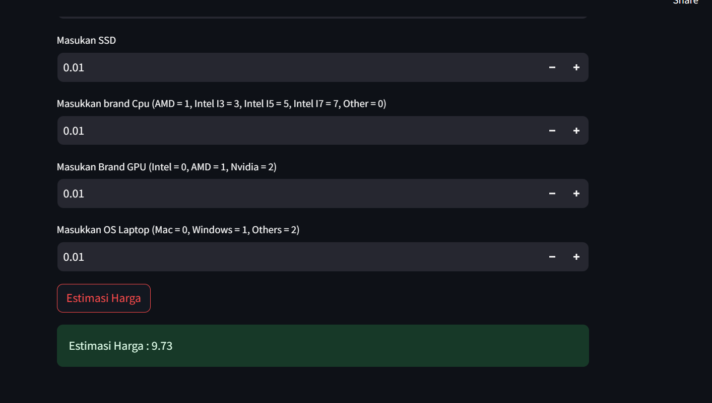

# Laporan Proyek Machine Learning
### Nama : Aji Ridwan Mas
### Nim : 211351008
### Kelas : Pagi A

## Domain Proyek

Laptop price prediction adalah estimasi harga laptop, ini digunakan sebagai patokan bagi semua orang yang ingin membeli laptop dengan spesifikasi tertentu.

## Business Understanding

### Problem Statements

- Ketidakmungkinan bagi seseorang untuk membeli laptop dengan spesifikasi harga tertentu.

### Goals

- Mencari solusi untuk memudahkan orang-orang untuk membeli laptop dengan spesifikasi tertentu.

### Solution statements
- Pengembangan Platform Laptop price prediction Berbasis Web, Solusi pertama adalah mengembangkan platform pengechekan harga laptop yang mengintegrasikan data dari Kaggle.com untuk memberikan pengguna akses mudah untuk mengetahui spesifikasi laptop dengan harga tertentu. 
- Model yang dihasilkan dari datasets itu menggunakan metode Linear Regression.

## Data Understanding
Dataset yang saya gunakan berasal dari Kaggle.<br> 

[Laptop price prediction](https://www.kaggle.com/datasets/gyanprakashkushwaha/laptop-price-prediction-cleaned-dataset).

### Variabel-variabel pada Laptop price prediction adalah sebagai berikut:
Ram : RAM adalah sebuah hardware baik di komputer, laptop maupun ponsel yang berfungsi untuk menyimpan data dari aplikasi yang bersifat sementara.

Weight : Berat laptop.

Ips : In-Plane Switching merupakan sebuah jenis layar monitor pada panel LCD yang dimana memungkinkan sebuah layar memiliki sudut pandang dan lebar.

Ppi : satuan yang menyatakan kepadatan piksel sebuah layar.

Cpu brand : perangkat keras komputer yang akan mengambil dan mengeksekusi instruksi

HDD : komponen komputer yang masuk dalam kategori storage device, untuk menyimpan data permanen pada komputer atau laptop.

SSD : tempat penyimpanan data untuk laptop.

Gpu brand : GPU (Graphics Processing Unit) merupakan sebuah komponen khusus berupa unit yang bertugas mengolah segala hal yang mengarah ke grafis baik itu berbentuk game, multimedia (video), gambar atau animasi 2D/3D dan lain sebagainya.

Os : Perangkat lunak terpenting yang dijalankan di komputer yang mengelola memori dan proses komputer, serta semua perangkat lunak dan perangkat kerasnya.

## Data Preparation
### Data Collection
Untuk data collection ini, saya mendapatkan dataset yang nantinya digunakan dari website kaggle dengan nama dataset Laptop price prediction, jika anda tertarik dengan datasetnya, anda bisa click link diatas.

### Data Discovery And Profiling
Untuk bagian ini, kita akan menggunakan teknik EDA. <br>
Pertama kita mengimport semua library yang dibutuhkan,
```bash
import pandas as pd
import numpy as np
import matplotlib.pyplot as plt 
import seaborn as sns
```

```bash
df = pd.read_csv("laptop_data_cleaned.csv")
df.head()
```

```bash
plt.figure(figsize=(10,8))
sns.heatmap(df.corr(),annot=True)
```

```bash
df.shape
```

```bash
df.isna().sum()
```

```bash
df.info()
```

```bash
def isfloat(num):
    try:
        float(num)
        return True
    except ValueError:
        return False
```

```bash
y = [x for x in df['Cpu_brand'] if isfloat(x) == False]
print(y)
```

```bash
df['Cpu_brand']=df['Cpu_brand'].replace(['Other Intel Processor','AMD Processor','Intel Core i5','Intel Core i7','Intel Core i3'],['0','1','5','7','3'])
df[['Cpu_brand']]=df[['Cpu_brand']].apply(pd.to_numeric)
```

```bash
y = [x for x in df['Gpu_brand'] if isfloat(x) == False]
print(y)
```

```bash
df['Gpu_brand']=df['Gpu_brand'].replace(['Intel','AMD','Nvidia'],['0','1','2'])
df[['Gpu_brand']]=df[['Gpu_brand']].apply(pd.to_numeric)
```

```bash
y = [x for x in df['Os'] if isfloat(x) == False]
print(y)
```

```bash
df['Os']=df['Os'].replace(['Mac','Windows','Others'],['0','1','2'])
df[['Os']]=df[['Os']].apply(pd.to_numeric)
```

### Membuat feature

Setelah seluruh kolom bertipe data integer dan memiliki nama yang cukup rapih, maka kita dapat membuat fitur dari kolom-kolom tersebut.
Feature digunakan sebagai parameter menghitung hasil estimasi/prediksi yang diharapkan. Hasil estimasi di dataset ini adalah kolom untuk membuat feature dan target dengan codingan sebgai berikut:

```bash
df.info()
```

```bash
features = ['Ram','Weight','Ips','Ppi','Cpu_brand','HDD','SSD','Gpu_brand','Os']
x = df[features]
y = df['Price']
x.shape, y.shape
```

## Modeling

```bash
from sklearn.model_selection import train_test_split
x_train, x_test, y_train, y_test = train_test_split(x,y,random_state=34,test_size=0.1)
y_test.shape
```

```bash
print(x_train.shape)
print(y_train.shape)
print(x_test.shape)
print(y_test.shape)
```

```bash
from sklearn.linear_model import LinearRegression
lr = LinearRegression()
lr.fit(x_train,y_train)
pred = lr.predict(x_test)
```

```bash
from sklearn import metrics
from sklearn.metrics import mean_squared_error
from math import sqrt
from sklearn.metrics import r2_score

r2=r2_score(y_test, pred)

rmse = sqrt(mean_squared_error(y_test, pred)) 
print(rmse,r2)
```


## Evaluation
Dalam proyek prediksi harga laptop dengan menggunakan Regresi Linear, metrik evaluasi yang saya gunakan adalah Root Mean Square Error (RMSE) dan R-squared (R^2). <br>
 - **Root Mean Square Error (RMSE)**
 Dalam proyek ini, RMSE sebesar **0.3059** menunjukkan bahwa model memiliki kesalahan rata-rata sekitar 0.3% dalam memprediksi harga laptop.<br>    
- **R-squared (R^2)**
Dalam proyek ini, R^2 sebesar **0.7605**, yang berarti model Anda mampu menjelaskan sekitar **0.76%** dari variabilitas harga laptop. Ini menunjukkan bahwa model ini memiliki kemampuan yang baik dalam menjelaskan variasi dalam harga laptop.

Berdasarkan metrik evaluasi RMSE dan R^2, proyek ini memberikan hasil yang positif. Model Regresi Linear yang telah dikembangkan mampu memprediksi harga laptop dengan akurasi yang baik. RMSE yang rendah menunjukkan bahwa kesalahan prediksi model relatif kecil, sementara R^2 yang tinggi mengindikasikan bahwa model mampu menjelaskan sebagian besar variabilitas dalam harga laptop.

```bash
print(x)
```

```bash
x.info()
```

```bash
y.iloc[0]
```

```bash
input_data = np.array([[8,1,1,226.983005,5,0,128,0,0]])

prediction = lr.predict(input_data)
print('Estimasi Harga Laptop :',prediction)
print('Harga Laptop Asli adalh :',y.iloc[0])
```

```bash
import pickle

filename = "estimasi_harga_laptop1.sav"
pickle.dump(lr,open(filename,'wb'))
```

## Deployment

[My Estimation App](https://appelaptop-iqx3x2avkkdx8vzyytstlh.streamlit.app/).

